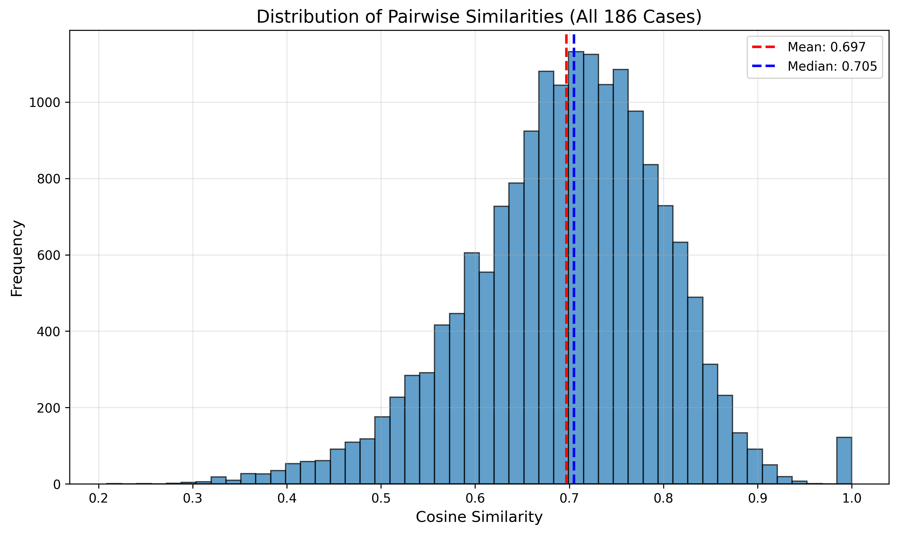
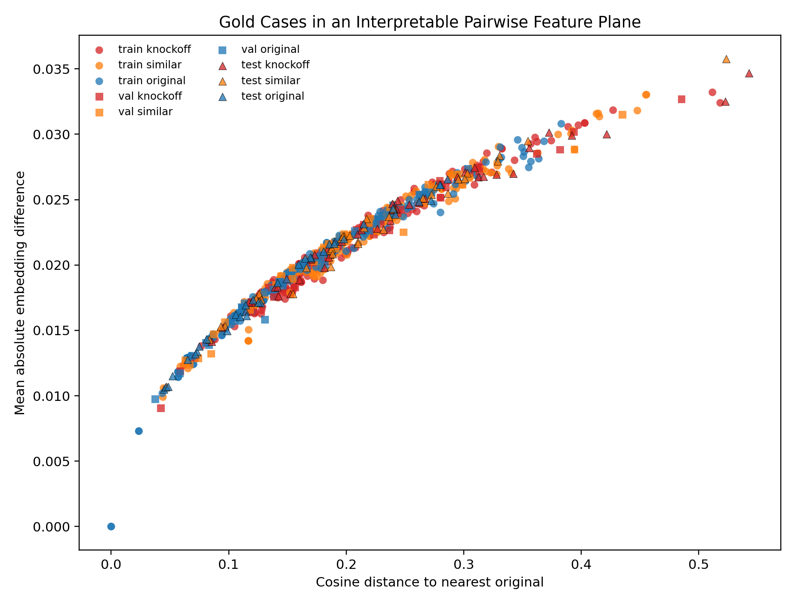

# Between Inspiration and Imitation:

## Graded Fashion Infringement Assessment with Deep Metric Learning and a Calibrated Decision Layer

**Student Number:** `\studentNumber`

---

## Abstract

Fashion design infringement sits at an ambiguous boundary between lawful inspiration and illegal copyright, making it poorly suited for binary visual similarity systems. This study formulates fashion infringement assessment as a graded three-class classification task over *original*, *similar*, and *knockoff* cases.

The implemented system follows a two-stage pipeline:

1. a deep metric-learning component provides fashion-aware visual representations, and
2. a calibrated downstream decision layer maps pairwise embedding-derived features into interpretable infringement categories and DMCA-style actions.

Using a curated dataset of fashion design cases, cosine-threshold baselines are compared with learned classifiers operating on nearest-original comparison features. The strongest current result is a pairwise multilayer perceptron decision layer, which achieves a test macro-F1 of **0.7368** in the uncalibrated comparison setting. After temperature scaling, the calibrated deployment-oriented version achieves **0.6926** test macro-F1 while improving validation expected calibration error from **0.1042** to **0.0857**.

These results indicate that graded infringement assessment is better handled by a calibrated non-linear decision layer than by fixed similarity thresholds alone, and that separating representation learning from decision calibration provides a more interpretable and practically useful framework for computer-assisted fashion copyright review.

---

## Introduction

Fashion design infringement is difficult to assess because the domain sits between artistic expression, functional design, and rapid commercial imitation. Many fashion copyright cases do not involve exact duplication, but rather ambiguous overlap in motifs, prints, proportions, or detailing. This creates a poor fit for binary knockoff/original systems. Legal analysis of fashion copyright has also emphasized that many design elements, including silhouettes, trends, and broad stylistic conventions, are only weakly protected or treated as functional rather than expressive, making the boundary between lawful inspiration and infringement especially difficult to prove and prosecute accordingly [17]. In the UK, the procedural reality of such lower-value and less complex intellectual property disputes is also reflected in the specialist role of the Intellectual Property Enterprise Court [14].

This study investigates whether fashion infringement can be modeled more effectively as a graded decision problem. Rather than asking only whether two designs are originals or knockoffs, the study considers three categories:

* *Original*
* *Similar*
* *Knockoff*

This framing reflects the practical reality that many fashion cases occupy an intermediate region of stylistic similarity that is neither clearly lawful inspiration nor clearly illegal copying.

This study is a two-stage pipeline that separates visual representation learning from downstream decision-making. First, a deep triplet metric-learning stage based on a ResNet encoder is used to learn fashion-aware embeddings from image data, as seen in prior metric-learning literature on similarity-based representation spaces [1, 2, 3, 16]. Second, a calibrated decision layer takes pairwise features derived from a candidate design and its nearest *original* reference and converts them into both class predictions and confidence-aware policy actions.

At the prediction level, the model assigns one of the three labels *original*, *similar*, or *knockoff*. At the policy level, those calibrated probabilities are translated into operational outcomes:

* **auto_flagged** for high-confidence predicted knockoffs
* **review** for borderline or uncertain cases
* **no_action** for low-confidence non-critical cases

This differs from prior retrieval-style systems by focusing not only on similarity estimation, but on interpretable and calibrated decision support for ambiguous cases in which the main question is not simply *“what is most similar?”*, but *“what action should be taken given the model’s confidence?”*

### Research Questions

1. Can embedding-based visual similarity support reliable distinction between *original*, *similar*, and *knockoff* fashion cases?
2. How sensitive are graded infringement decisions to the choice of thresholding versus learned non-linear decision layers?
3. Can deep metric learning on fashion imagery provide a stronger representation space for downstream infringement assessment?

The strongest current evidence comes from the multilayer perceptron calibrated decision layer rather than from a completed end-to-end evaluation of metric-learning variants. The experiments show that decision calibration and pairwise feature design are critical to the task, and that they provide a strong baseline against which future representation-learning improvements can be measured.

Compared with the CW3 plan, the emphasis of the final report shifts slightly. The interim plan was to explore a broad comparison of metric-learning variants and downstream effects, whereas the classification results are strongest for the calibrated multilayer perceptron decision layer built on the present embedding pipeline. The final report reflects this change directly. The study treats the deep metric-learning component as the representation-learning foundation of the project, while presenting the most complete empirical findings around graded classification, calibration, and DMCA-style triage.

---

## Task and Data

The primary task is graded fashion infringement classification. Each example is represented as an embedding associated with a fashion design case and compared against a nearest *original* reference design. The downstream classifier predicts one of three classes:

* **Original**: visually and semantically distinct from the nearest protected design
* **Similar**: shares stylistic attributes but differs in expressive detail
* **Knockoff**: highly overlapping in expressive detail and likely copied

The multilayer perceptron uses a dataset of **743 embedded comparisons** with **512-dimensional feature vectors**, split into:

* **519** training examples
* **110** validation examples
* **114** test examples

The class mapping is:

* `knockoff = 0`
* `similar = 1`
* `original = 2`

To clean both the DeepFashion and gold-cases datasets, cleaning scripts for constructing the evaluation split from curated and scraped fashion-design cases are included in the code zip. The custom case embeddings are produced by encoding textual design descriptions with a frozen CLIP text encoder and then L2-normalizing the resulting 512-dimensional vectors. CLIP (Contrastive Language-Image Pre-training) is a multimodal model trained to align images and text in a shared embedding space; in this study, only the text encoder is used to convert design descriptions into fixed-length semantic representations [4].

These embeddings are subsequently stabilized, split into train/validation/test partitions, and transformed into pairwise comparison features. Preprocessing for the decision-layer experiments includes nearest-original retrieval by cosine similarity and feature construction from the sample-to-reference difference. The resulting pairwise statistical features include cosine similarity, cosine distance, Euclidean distance, absolute-difference statistics, and related summary features.

For representation learning, the project uses **DeepFashion** as an image dataset of over 40,000 images to create a robust model for visually categorizing fashion items [5]. DeepFashion does not contain infringement labels, but it provides textual item identity information that allows positive pairs or triplets to be formed from different views of the same garment and negatives to be drawn from different items.

Before entering the encoder, each RGB image is:

1. resized to 256 pixels on the shorter side,
2. center-cropped to `224 × 224`,
3. converted to a tensor, and
4. normalized channel-wise using the standard ImageNet mean `[0.485, 0.456, 0.406]` and standard deviation `[0.229, 0.224, 0.225]`.

This keeps the input format aligned with the ImageNet pretraining regime of the ResNet backbone and allows the model to separate generic fashion representation learning from the smaller, more subjective infringement-classification layer.

The main evaluation metrics are **classification accuracy** and **macro-averaged F1 score**. Macro-F1 is especially important here because it evaluates class balance more fairly than accuracy alone and better reflects performance on the ambiguous middle class. For the calibrated policy analysis, the report additionally evaluates **expected calibration error**, **confidence-threshold trade-offs**, and **knockoff auto-flag precision/recall**.

### Similarity Distribution



---

## Methodology

The study uses a two-stage methodology because similarity learning and infringement decision-making are related but distinct problems. The representation model should capture visual proximity between fashion items, while the final classifier must translate that proximity into stable and interpretable labels under legal and semantic ambiguity.

### Representation Learning

The representation learning stage is implemented as a triplet-network pipeline with a shared-weight ResNet backbone. Three parallel paths with tied weights process the anchor, positive, and negative inputs with the same encoder parameters, so the network learns a single embedding function rather than separate class-specific predictors.

The backbone can be either `resnet18` or `resnet50`, initialized from ImageNet-pretrained weights. The original classification layer is removed and replaced with a linear embedding head that maps the final pooled ResNet feature vector to a **128-dimensional** representation. This gives a compact descriptor that is large enough to retain garment-level detail, while still being small enough for stable metric learning and nearest-neighbor comparison [9].

From an architectural perspective, the encoder is a standard convolutional residual network. The input image first passes through an initial large-kernel convolution, normalization, non-linearity, and spatial downsampling stage, which rapidly converts raw RGB pixels into low-level feature maps. These early convolutional filters typically respond to primitive visual structure such as edges, corners, color boundaries, and local texture changes. Subsequently, the network applies a sequence of residual stages that progressively increase channel depth while reducing spatial resolution. This coarse-to-fine hierarchy is useful for fashion imagery because it lets the model combine local evidence such as stitching, pleats, or print fragments with broader shape evidence such as neckline, sleeve geometry, skirt length, or overall silhouette.

The residual design is especially important in this study because it allows deeper convolutional feature extraction without making optimization unstable. Each residual block learns a transformation relative to an identity shortcut, so later layers can refine rather than completely overwrite earlier representations. This helps the backbone preserve visually important garment signals across depth: lower layers retain local texture and contour information, intermediate layers assemble motifs and garment parts, and later layers encode more global configurations that are useful for item-level comparison.

Fine-tuning is deliberately restricted to the last residual block (`layer4`) and the new embedding head while earlier convolutional layers remain frozen. This partial-freezing strategy reduces the number of trainable parameters, which is important given the modest scale of the available fashion-identity training setup [1, 2, 16].

The two supported ResNet backbones differ mainly in depth and representational capacity:

* **`resnet18`** is lighter-weight and easier to train in smaller-data regimes.
* **`resnet50`** is deeper and richer, but more computationally expensive.

Triplets are constructed from textualized item identities in the image dataset. For each anchor image, a positive example is drawn from another image of the same item and a negative example is drawn from a different item. This means the supervision signal does not rely on infringement labels at this stage, only on the weaker assumption that two photographs of the same garment should lie nearby in the learned space, while different garments should be separated.

After the forward pass, each branch output is L2-normalized, so comparison is based on angular similarity rather than raw feature magnitude. The model is trained with a cosine-distance triplet objective:

```math
\mathcal{L} = \max(0, d(a,p) - d(a,n) + m)
```

where `d(·,·)` is cosine distance and `m` is a margin hyperparameter. In this study:

```math
m = 0.2
```

Optimization uses Adam [15] with:

* learning rate: `1e-4`
* batch size: `32`
* weight decay: `1e-4`
* epochs: `10`

These settings are deliberately conservative because the model is initialized from ImageNet-pretrained weights and only the later layers are fine-tuned.

### Calibrated Decision Layer

The downstream classifier operates on pairwise features derived from the embedding of a candidate design and its nearest *original* reference in the training set. For each example, cosine similarity is used to identify the nearest reference original among the training items labeled *original*. This anchors every decision against the closest protected-style reference rather than against an arbitrary neighbor from any class.

Features are then computed from the sample-reference pair. The main input is the element-wise absolute-difference vector `|x - r|`, which retains per-dimension disagreement information from the embedding space. This vector is augmented with scalar statistical summary features:

* cosine similarity
* cosine distance
* Euclidean distance
* mean absolute difference
* variance of absolute difference
* maximum absolute difference
* 95th percentile of absolute differences
* gap between the highest and second-highest reference similarities

The last quantity acts as a retrieval-stability feature: a small gap indicates that the nearest-original match is ambiguous, while a large gap suggests a more decisive comparison.

Three decision strategies are evaluated:

1. **Cosine-threshold baseline**: searches for two validation thresholds `t1 < t2` to partition examples into *Original*, *Similar*, and *Knockoff*
2. **Logistic regression** on scalar pairwise features
3. **Multilayer perceptron (MLP)** with two hidden layers of sizes `[256, 64]` applied to the concatenation of absolute-difference features and scalar pairwise features

The MLP is trained as a Stage-2 classifier with standardized inputs and the default non-linear hidden activations of `sklearn`’s `MLPClassifier`, using early stopping.

For deployment-oriented analysis, the MLP probabilities are calibrated using **temperature scaling** on the validation set [6]. The uncalibrated class-probability vector `p` is first converted to log-probabilities `log p`. A scalar temperature `T` is then selected by grid search over validation values from `0.5` to `5.0` to minimize negative log-likelihood. The calibrated probabilities are computed as:

```math
\tilde{p}_k = \frac{\exp(\log p_k / T)}{\sum_j \exp(\log p_j / T)}
```

When `T > 1`, the distribution is softened and overconfident predictions are reduced; when `T < 1`, the distribution is sharpened. In the experiments, the learned temperature is:

```math
T = 1.55
```

After temperature scaling, the predicted class is still the `argmax` of the calibrated distribution, but the confidence values become better aligned with empirical correctness. These calibrated probabilities are then mapped to policy actions through two thresholds:

* predicted **knockoff** with confidence at least `τ_auto` → `auto_flag`
* otherwise, confidence at least `τ_review` → `review`
* otherwise → `no_action`

This turns the model into a triage mechanism for handling ambiguity between knockoffs and similar designs, closely related to selective prediction or reject-option learning in uncertainty-aware classification [7, 13].

---

## Experiments

The main research question this study explores is whether a graded infringement decision layer can be built from existing visual embeddings, and how much calibration improves its practical usefulness.

### Experiment 1: Threshold Baseline

The first experiment evaluates whether simple similarity thresholds are sufficient. Two thresholds are selected on the validation set and then applied to the test set. This provides a transparent but deliberately limited baseline.

### Experiment 2: Learned Linear Baseline

The second experiment uses logistic regression on scalar pairwise features. The purpose is to test whether a learned but linear boundary already improves on thresholding.

### Experiment 3: Learned Non-Linear Decision Layer

The third experiment uses a multilayer perceptron over the concatenation of absolute-difference features and scalar pairwise statistics. This tests whether non-linear interactions between embedding-derived features are necessary to separate the ambiguous *similar* region from the *original* and *knockoff* classes.

### Experiment 4: Calibration and Policy Analysis

The final experiment calibrates the multilayer perceptron outputs using temperature scaling and evaluates policy-oriented thresholds for `auto_flag`, `review`, and `no_action`. In practical fashion copyright cases, confidence-aware triage and false-positive control are essential beyond raw classification accuracy.

All downstream classifier experiments use the same fixed train/validation/test split, the same nearest-original feature construction, and the same macro-F1/accuracy metrics. Evaluation includes confidence intervals, confusion matrices, and exported error-case summaries.

The nearest-*original* comparison design is important because the legal and practical question is not whether a candidate resembles any arbitrary example in the dataset, but whether it most closely approaches a protected-style reference that could plausibly ground an infringement concern. Restricting the reference set to training cases labeled *Original* therefore makes the comparison more interpretable and more aligned with the intended downstream use.

### Reproducibility Settings

* Threshold baseline: validation-set cosine-distance quintile search for `t1 < t2`
* Logistic regression: standardized scalar pairwise features
* MLP: hidden layers `[256, 64]`, standardized inputs, up to `400` iterations
* Temperature scaling: fitted on validation split, learned `T = 1.55`
* Triplet model:

  * ImageNet-pretrained ResNet backbone
  * embedding dimension `128`
  * margin `0.2`
  * learning rate `1e-4`
  * batch size `32`
  * `10` epochs
  * random seed `42`

The reported MLP metrics correspond to the current embedding pipeline based on frozen CLIP text encodings of case descriptions.

---

## Results and Evaluation

### Graded Infringement Classification

The main uncalibrated comparison results are summarized below:

| Model                          |   Accuracy |   Macro-F1 |
| ------------------------------ | ---------: | ---------: |
| Cosine Thresholds              |     0.4825 |     0.4809 |
| Logistic Regression (pairwise) |     0.4474 |     0.4485 |
| **MLP (abs diff + pairwise)**  | **0.7368** | **0.7368** |

The cosine-threshold baseline achieves a test macro-F1 of **0.4809**, indicating that rigid partitions in embedding-distance space are insufficient for the three-class problem. Logistic regression on pairwise features performs similarly poorly, with a macro-F1 of **0.4485**. In contrast, the pairwise MLP achieves **0.7368** macro-F1 and **0.7368** accuracy, showing that a learned non-linear boundary over richer pairwise features can capture the ambiguity structure of the task much more effectively.

The threshold baseline assumes that infringement categories can be arranged as simple consecutive bands along a single cosine-distance axis. The lower macro-F1 suggests that this assumption is too primitive: many cases that are close to an original are not necessarily knockoffs, and some knockoff-like cases are distinguishable only when the pattern of embedding differences is taken into account rather than overall magnitude alone.

The saved test confusion matrix for the MLP is:

```text
[[29, 6, 5],
 [ 4,27, 6],
 [ 3, 6,28]]
```

using label order `[knockoff, similar, original]`, where rows correspond to true labels and columns correspond to predicted labels.

### Confusion Heatmaps


### Calibration and DMCA Policy Analysis

After temperature scaling, the MLP achieves:

* **0.6930** test accuracy
* **0.6926** test macro-F1

Validation expected calibration error improves from **0.1042** before calibration to **0.0857** after calibration, indicating that the predicted probabilities better reflect empirical correctness.

### Reliability Plot


The threshold baseline obtains a 95% confidence interval of `[0.3873, 0.5650]` for test macro-F1, while the calibrated MLP achieves `[0.6034, 0.7710]`. Although calibration slightly reduces raw classification performance relative to the best uncalibrated MLP model, it yields probabilities that are more useful for downstream confidence-aware policy selection.

Since temperature scaling is designed to improve the reliability of confidence estimates rather than optimize discrete class prediction directly, this small reduction in classification score does not necessarily imply a weakness in the model. The calibrated model may become slightly less sharp in its top-1 outputs while becoming more trustworthy as a basis for action thresholds.

Under a conservative policy with `τ_auto = 0.80` and `τ_review = 0.55`, the model:

* auto-flags **17** test cases
* sends **68** to review
* assigns **29** to no action

At this operating point:

* auto-flag precision for true knockoffs = **0.882**
* auto-flag recall = **0.375**
* false-positive auto-flags = **2**

A more permissive alternative with `τ_auto = 0.70` and `τ_review = 0.70` raises auto-flag recall to **0.400**, but lowers auto-flag precision to **0.800** and increases false-positive auto-flags to **4**.

### Policy Precision-Recall Trade-Off


### Policy Results

| Policy        |   Acc. |     F1 | AF Prec. | AF Rec. | FP AF |
| ------------- | -----: | -----: | -------: | ------: | ----: |
| Threshold     | 0.4825 | 0.4809 |       -- |      -- |    -- |
| Cal. MLP      | 0.6930 | 0.6926 |       -- |      -- |    -- |
| `0.80 / 0.55` |     -- |     -- |    0.882 |   0.375 |     2 |
| `0.70 / 0.70` |     -- |     -- |    0.800 |   0.400 |     4 |

**AF = auto-flag**

These results suggest that the system is best interpreted as a calibrated triage mechanism rather than a hard classifier. The relevant trade-off is not only between classes, but between false-positive enforcement risk and automatic catch rate.

### Discussion

Because ambiguous similarity versus knockoff cases in fashion infringement are inherently nuanced, a discrete 3-class classifier is more complex than generic visual retrieval. The intermediate *similar* class cannot be captured reliably by a fixed threshold alone.

The absolute-difference and nearest-original feature design appears effective, since the MLP substantially improves on both thresholding and logistic regression. Calibration also matters for deployment framing. Even when the uncalibrated MLP has the best macro-F1, the calibrated model is more suitable for confidence-based review workflows.

Most difficult cases arise around the boundary between *similar* and *knockoff*, which is consistent with the semantics of the task rather than with a simple failure to capture gross visual similarity. The classifier is being asked to resolve a category boundary that is itself subjective and partly legal in nature, so residual confusion in this region should be expected.

There are also clear limitations:

* the strongest empirical evidence is for the MLP decision layer, not a full end-to-end comparison of learned embedding models
* the labels encode a legally and semantically subjective boundary, especially between *similar* and *knockoff*
* the dataset remains relatively small for a high-variance visual task

The system should therefore be interpreted as a calibrated decision-support tool whose purpose is to structure review workload and risk exposure, not to produce definitive legal judgments.

---

## Related Work

Computer vision approaches to similarity matching have historically focused on retrieval, verification, and near-duplicate detection rather than on graded legal judgment. Earlier systems used hand-crafted local features and image matching pipelines to identify duplicated or highly overlapping images. These methods are effective when the task is exact or near-exact matching, but they are less suitable when similarity is partial, stylistic, or semantically ambiguous, as is often the case in fashion.

More recent work has shifted toward learned visual embeddings. Siamese and triplet architectures learn a representation space in which semantically similar inputs are close under a distance metric, enabling ranking and nearest-neighbor retrieval. Early Siamese-network work established shared-weight neural architectures for similarity learning [1], while FaceNet demonstrated the effectiveness of triplet loss for embedding learning in visual verification [2]. Subsequent work argued that triplet-based metric learning can remain highly competitive when supported by appropriate mining strategies [10], and alternative loss formulations such as quadruplet loss were proposed to strengthen inter-class separation beyond standard triplet constraints [11]. Later metric-learning work also emphasized that performance depends strongly on how informative positives and negatives are weighted or mined during training [16]. Self-supervised contrastive methods such as SimCLR later showed that strong transferable image representations can be learned without dense manual labels [3]. CLIP further demonstrated that large-scale contrastive pretraining can align visual and textual representations in a shared embedding space [4].

In fashion vision specifically, datasets such as DeepFashion have enabled work on retrieval, attribute prediction, and consumer-to-shop matching [5]. These studies show that neural representations can capture fine-grained cues such as texture, cut, silhouette, and detailing. However, the dominant evaluation settings in this literature are retrieval quality and binary matching rather than graded semantic or legal distinctions.

This study builds on that literature by treating similarity as an intermediate signal rather than the final output. The contribution lies in combining a deep representation-learning stage with a calibrated decision layer that turns pairwise similarity structure into three-way labels and review actions. This makes the work related not only to metric learning, but also to calibration and decision-support systems for high-ambiguity classification, including selective-prediction settings in which the model should act conservatively on low-confidence cases [7, 8].

---

## Conclusions

This study shows that graded fashion infringement assessment is feasible as a three-class classification problem, but only when the similarity signal is coupled with a learned non-linear decision layer. Across the experiments, fixed cosine thresholds performed poorly, while a pairwise MLP over embedding-derived features gave the strongest test performance. Calibration then turns that classifier into a more useful confidence-aware review tool [6].

The main lesson from the study is that separating representation learning from decision calibration is productive in this domain. Deep metric learning provides the conceptual and technical basis for learning fashion-aware embeddings [1, 2, 3], while the MLP decision layer makes the final task interpretable, analyzable, and tunable for risk-sensitive operation. The current strongest evidence therefore supports the calibrated decision-layer formulation, with metric-learning improvements remaining an important next step rather than an already-closed empirical question.

With respect to the research questions, the results support three main conclusions:

1. Embedding-based similarity does contain useful infringement signal, but not in a form that can be used directly through raw similarity alone.
2. Graded infringement decisions are highly sensitive to the form of the decision rule, since both fixed thresholds and linear baselines perform substantially worse than the non-linear MLP.
3. Deep metric learning remains a justified representation-learning strategy for the project, but the strongest completed empirical evidence currently lies in the calibrated downstream classifier rather than in a full end-to-end comparison of learned visual backbones.

Overall, a two-stage calibrated decision pipeline is effective for the present task, while improved representation learning remains the clearest direction for future work.

Future work should:

* evaluate multiple learned embedding backbones end-to-end on the same downstream task
* increase the scale and annotation consistency of the infringement dataset
* study whether richer multimodal signals such as textual descriptions or structured design attributes further improve separation between *similar* and *knockoff* cases

---

## Appendix

### Additional Plots



### Additional Dataset and Label Notes

The downstream classifier used in the report contains **743 embedded examples** split into **519 training**, **110 validation**, and **114 test** cases. The class mapping is:

* `knockoff = 0`
* `similar = 1`
* `original = 2`

For training examples that are themselves labelled *original*, nearest-original feature construction excludes the item itself from the reference search, preventing trivial self-matches.

An important limitation is that the representation-learning and decision-layer stages are not yet evaluated as a single unified end-to-end experimental stack on the same final infringement benchmark. The report therefore combines two kinds of evidence:

* image-based triplet-learning infrastructure for representation learning
* the strongest completed quantitative results from the Stage-2 calibrated classifier built on stabilized CLIP text embeddings

---

## References

1. Koch, G., Zemel, R., and Salakhutdinov, R. *Siamese neural networks for one-shot image recognition.* In **ICML Deep Learning Workshop**, 2015.
2. Schroff, F., Kalenichenko, D., and Philbin, J. *FaceNet: A unified embedding for face recognition and clustering.* In **CVPR**, 2015.
3. Chen, T., Kornblith, S., Norouzi, M., and Hinton, G. *A simple framework for contrastive learning of visual representations.* In **ICML**, 2020.
4. Radford, A., Kim, J. W., Hallacy, C., Ramesh, A., Goh, G., Agarwal, S., et al. *Learning transferable visual models from natural language supervision.* In **ICML**, 2021.
5. Liu, Z., Luo, P., Qiu, S., Wang, X., and Tang, X. *DeepFashion: Powering robust clothes recognition and retrieval with rich annotations.* In **CVPR**, 2016.
6. Guo, C., Pleiss, G., Sun, Y., and Weinberger, K. Q. *On calibration of modern neural networks.* In **ICML**, 2017.
7. Geifman, Y. and El-Yaniv, R. *SelectiveNet: A deep neural network with an integrated reject option.* In **ICML**, 2019.
8. Widmann, D., Lindsten, F., and Zachariah, D. *Calibration tests in multi-class classification: A unifying framework.* In **NeurIPS**, 2019.
9. He, K., Zhang, X., Ren, S., and Sun, J. *Deep residual learning for image recognition.* In **CVPR**, 2016.
10. Hermans, A., Beyer, L., and Leibe, B. *In defense of the triplet loss for person re-identification.* *arXiv preprint arXiv:1703.07737*, 2017.
11. Chen, W., Chen, X., Zhang, J., and Huang, K. *Beyond triplet loss: A deep quadruplet network for person re-identification.* In **CVPR**, 2017.
12. Naeini, M. P., Cooper, G. F., and Hauskrecht, M. *Obtaining well calibrated probabilities using Bayesian binning.* In **AAAI**, 2015.
13. El-Yaniv, R. and Wiener, Y. *On the foundations of noise-free selective classification.* *Journal of Machine Learning Research*, 11:1605–1641, 2010.
14. GOV.UK. *About us -- The Intellectual Property List.* *GOV.UK*, 2025.
15. Kingma, D. P. and Ba, J. *Adam: A method for stochastic optimization.* In **ICLR**, 2015.
16. Yu, R., Dou, Z., Bai, S., Zhang, Z., Xu, Y., and Bai, X. *Hard-aware point-to-set deep metric for person re-identification.* In **ECCV**, 2018.
17. Lukose, L. P. and Abrol, C. *Intellectual property protection of fashion designs in the AI era: A critique.* *Journal of the Indian Law Institute*, 2023.
